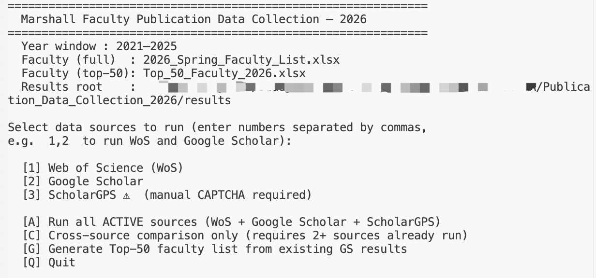

# Marshall Faculty Publication Data Collection

Automated pipeline for extracting, aggregating, and comparing publication and citation data for Marshall School of Business faculty from multiple academic databases.

**Active sources:** Web of Science (WoS), Google Scholar, ScholarGPS


## API Keys

**Google Scholar (SerpAPI)**

Uses a shared lab account — **no registration needed**.

- Account: avdresearch@marshall.usc.edu
- Password: stored in `code/.env` (ask your supervisor if you don't have access)
- Log in at [https://serpapi.com/dashboard](https://serpapi.com/dashboard) and copy the API key

**Web of Science (Clarivate)**

Each user registers their own free account.

1. Go to [https://developer.clarivate.com/](https://developer.clarivate.com/) and sign up with your USC email
2. Subscribe to the **Web of Science Starter API**
3. Once approved, copy your API key from the application details page


## Annual Setup (Start of Each Year)

Before running the pipeline, update the faculty list for the new year:

1. **Update the faculty list**

   - Run `update_faculty_list.py` to merge the new semester's faculty list with researcher IDs (WoS, Google Scholar, ORCID, SCOPUS) from the prior year:

     ```bash
     cd code
     python update_faculty_list.py
     ```


   - This produces a two-sheet Excel file:

     - **Sheet 1 "Updated Faculty List"** — all faculty, colour-coded by match status:
       - **MATCHED** (green) — IDs carried over automatically
       - **UNSURE** (amber) — similar name found; verify it's the same person
       - **NEW** (yellow) — no match; contact for researcher IDs
   - **Sheet 2 "Review Required"** — only UNSURE + NEW rows for quick actioning


2. **Update `config.py`**

   - Point `FACULTY_FULL_PATH` to the new faculty list file:

     ```python
     # code/config.py
     FACULTY_FULL_PATH = _ROOT / "2026_Spring_Faculty_List.xlsx"  # ← update each semester or year
     ```


   - Everything else (`YEAR_START`, `YEAR_END`, `FACULTY_TOP50_PATH`) updates automatically based on the current calendar year.


## Running the Pipeline

1. **Set up virtual environment and install dependencies (first time only)**

   ```python
   # From the project root
   python3 -m venv venv
   source venv/bin/activate
   pip install -r code/requirements.txt
   ```

   > **Each new terminal session:** run `source venv/bin/activate` from the project root before running any pipeline commands.

2. **Set up credentials (first time only)**

   See the [API Keys](#api-keys) section above for how to obtain each key, then:

   ```bash
   # Copy the template to create your local credentials file
   cp code/.env.example code/.env
   # Open the .env credentials file and fill in your keys
   SERPAPI_KEY=your_serpapi_key_here
   WOS_API_KEY=your_wos_key_here
   CHROMEDRIVER_PATH=/path/to/chromedriver   # required for ScholarGPS only
   ```


3. **Run the Pipeline (`main.py`)**

   ```python
   cd code
   python main.py   
   ```

   You should see the interactive menu:

   

   Select [1] to run Google Scholar first.

   Google Scholar extraction:

   - Covers **all faculty** from the master list
   - Collects publication + citation data for the configured 5-year window
   - Automatically generates: `data/Top_N_Faculty_{year}.xlsx` — the input list for WoS.

4. **Review the Top-N list**
   - Open `data/Top_N_Faculty_{year}.xlsx`. 
   - Gold-highlighted rows need attention: fill in any missing **WoS ResearchID**.


5. **Run WoS**

   After confirming the Top-N list is complete, run `main.py` again:

   ```bash
   cd code
   python main.py   # select [2] Web of Science
   ```

   The WoS stage will:

   - Extract publications for Top-N faculty
   - Filter to the configured 5-year window
   - Generate ranked citation outputs
   - Log any missing or invalid IDs

6. **Run ScholarGPS** *(requires manual CAPTCHA solving — keep terminal open)*

   ScholarGPS also uses the Top-N faculty list. Before running, ensure ChromeDriver is installed
   and matches your Chrome version (see `docs/scholargps_documentation_2026.md` for setup).

   > **ChromeDriver version mismatch?** Chrome auto-updates but ChromeDriver does not. If you see
   > a `SessionNotCreatedException` error, run `brew upgrade --cask chromedriver` to fix it, then
   > allow it in **System Settings → Privacy & Security** if prompted.

   ```bash
   cd code
   python main.py   # select [3] ScholarGPS (or run alongside [2])
   ```

   When a CAPTCHA appears in the Chrome window, solve it manually, then press **Enter** in the
   terminal to resume. Budget 30–60 minutes depending on how often CAPTCHAs appear.

   > **Tip:** You can also run all three sources in one go with **[A]**, but you must stay at the
   > terminal to handle any CAPTCHAs during the ScholarGPS stage.


## Input Files

| File | Location | Used by |
|------|----------|---------|
| `{year}_{semester}_Faculty_List.xlsx` | project root | Google Scholar extractor, Top-N generator |
| `data/Top_N_Faculty_{year}.xlsx` | `data/` (auto-generated) | WoS extractor, ScholarGPS extractor |

The faculty list is the single master file. It should contain:
`Last Name`, `First Name`, `Department`, `Email`, `Faculty Type`,`Google Scholar Profile Link`, `WoS`, `scholargps`, `ORCID`, `SCOPUS_ID`.

> **Note — not committed to git:** Faculty list files (`*Faculty*.xlsx`) and the `data/` directory are excluded from version control because they contain personal information (email addresses, researcher IDs). Store these files on the shared Google Drive project folder instead.


## Project Structure

```
Publication_Data_Collection_{year}/
├── {year}_{semester}_Faculty_List.xlsx ← master faculty + ID file (update each semester or year)
├── data/                              ← auto-generated files (Top-N list output)
├── results/                           ← all extraction outputs (auto-created)
│   ├── wos/
│   ├── google_scholar/
│   ├── scholargps/
│   └── comparison/
├── code/
│   ├── main.py                        ← single entry point — run this
│   ├── config.py                      ← update FACULTY_FULL_PATH each semester or year
│   ├── .env                           ← API keys (not committed to git)
│   ├── .env.example                   ← template for .env
│   ├── requirements.txt               ← Python dependencies
│   ├── update_faculty_list.py         ← merges new faculty list with prior-year IDs
│   ├── sources/
│   │   ├── wos/                       ← Web of Science (API)
│   │   ├── google_scholar/            ← Google Scholar (via SerpAPI)
│   │   └── scholargps/                ← ScholarGPS (Selenium, manual CAPTCHA)
│   └── utils/
│       ├── faculty_loader.py          ← shared Excel loading utility
│       ├── generate_top_N_faculty.py  ← auto-generates Top-N list from GS results
│       └── comparison.py              ← cross-source ranking + charts
└── docs/
    ├── README.md
    ├── architecture-publication-data-collection-2026-02-27.md
    ├── WoS_documentation_2026.md
    ├── google_scholar_documentation_2026.md
    └── scholargps_documentation_2026.md
```


## Pipeline Flow

```
{year}_{semester}_Faculty_List.xlsx
        │
        ▼
[1] Google Scholar extractor       (all faculty, via SerpAPI)
        │
        ▼
results/google_scholar/Google_Scholar_Citations_Last_Five_Years.csv
        │
        ▼ auto
generate_top_N_faculty.py          (top N by GS citations + WoS ID lookup)
        │
        ▼
data/Top_N_Faculty_{year}.xlsx     ← review & fill in flagged rows
        │
        ├─────────────────────────────────────┐
        ▼                                     ▼
[2] WoS extractor                    [3] ScholarGPS extractor
    (top N faculty, Clarivate API)       (top N faculty, Selenium)
        │                                     │
        ▼                                     ▼
results/wos/                         results/scholargps/
WoS_Citations_Last_Five_Years.csv    ScholarGPS_Citations_Last_Five_Years.csv
        │                                     │
        └──────────────┬──────────────────────┘
                       ▼ auto (if 2+ sources ran)
               comparison.py
                       │
                       ▼
        results/comparison/Comparison_Ranked.csv + charts
```


## `main.py` Menu

```
  Run in order:

  [1] Google Scholar          ← always run first
        Covers all faculty via SerpAPI.
        Auto-generates Top-N list when done — review before Step 2.

  [2] Web of Science          ← after reviewing Top-N list
        Covers Top-N faculty via Clarivate API.

  [3] ScholarGPS              ← can run alongside [2], requires manual CAPTCHA solving
        Covers Top-N faculty via browser automation (~30–60 min).

  [C] Compare + Outlier Report  ← after 2+ sources complete
        Merges sources, ranks faculty, flags anomalies.

  ──────────────────────────────────────────────────────────
  [A] Run all sources at once  (1 → 2 → 3 → C)
  [Q] Quit

  Advanced (not regularly needed):
  [G] Regenerate Top-N list   [O] Outlier report only
  [4] Re-agg WoS   [5] Re-agg Google Scholar   [6] Re-agg ScholarGPS
```


## Output Files

| Location | File | Description |
|----------|------|-------------|
| `data/` | `Top_N_Faculty_{year}.xlsx` | Auto-generated Top-N list (WoS input) |
| `results/wos/` | `WoS_Publications_FULL.csv` | All WoS publications |
| `results/wos/` | `WoS_Citations_Last_Five_Years.csv` | Faculty rankings by WoS citations |
| `results/google_scholar/` | `Google_Scholar_Publications_FULL.csv` | All GS publications |
| `results/google_scholar/` | `Google_Scholar_Citations_Last_Five_Years.csv` | Faculty rankings by GS citations |
| `results/scholargps/` | `ScholarGPS_Publications_FULL.csv` | All ScholarGPS publications |
| `results/scholargps/` | `ScholarGPS_Citations_Last_Five_Years.csv` | Faculty rankings by ScholarGPS citations |
| `results/comparison/` | `Comparison_Ranked.csv` | Raw merged data — all sources, average citations, final rank |
| `results/comparison/` | `Citation_Comparison_All_Sources.xlsx` | Formatted Excel — all sources colour-coded, rank discrepancies highlighted |
| `results/comparison/` | `comparison_chart_all_sources.png` | Grouped bar chart — all sources, top 30 faculty |
| `results/comparison/` | `Outlier_Report.xlsx` | Flagged citation anomalies (auto-generated after comparison) |


## Year Window

Auto-computed in `config.py` — always covers the 5 most recent complete years.
No manual update needed.

Formula: `YEAR_END = current_year − 1`, `YEAR_START = YEAR_END − 4`.
For a 2026 run this yields **2021–2025**.


## Documentation

- **Architecture:** `docs/architecture-publication-data-collection-2026-02-27.md`
- **WoS details:** `docs/WoS_documentation_2026.md`
- **Google Scholar details:** `docs/google_scholar_documentation_2026.md`
- **ScholarGPS details:** `docs/scholargps_documentation_2026.md`
- **Outlier report:** `docs/outlier_report_documentation_2026.md`
- **Data issues log:** `docs/data_issues_log.md`


## Contact

- **Author:** Lizzy Chen
- **Email:** LizzyChen@outlook.com
